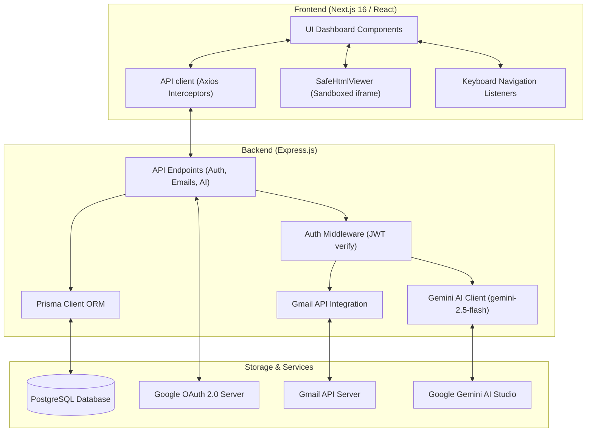
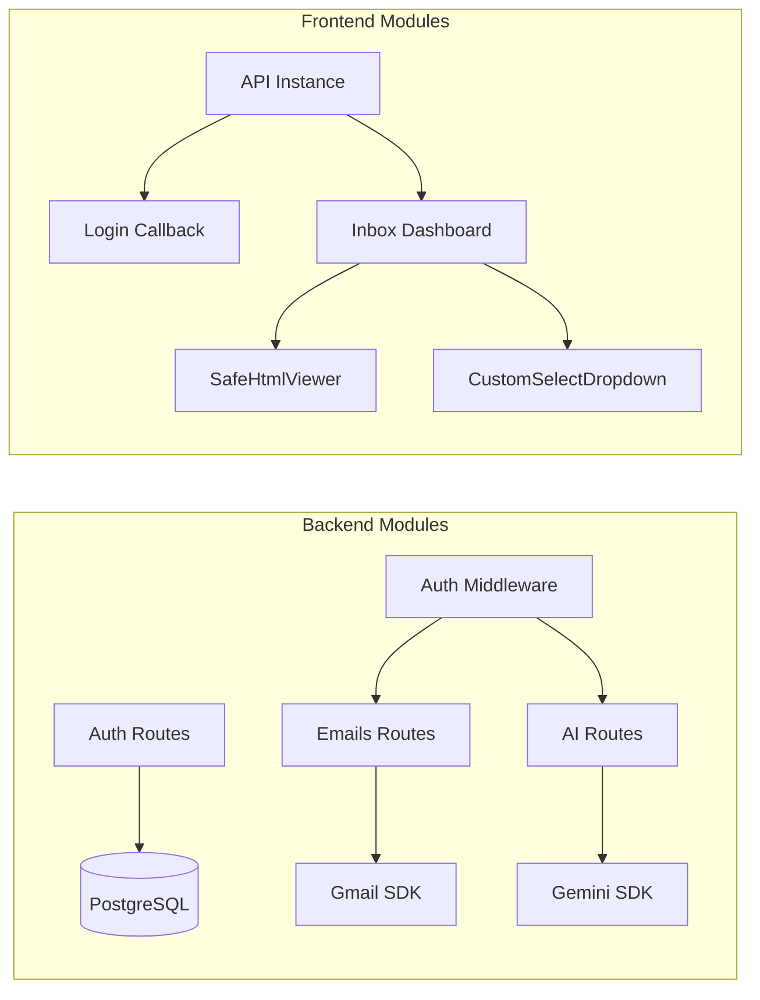

# AI Email Assistant (Hermes)

A production-grade, AI-augmented email assistant designed for high-efficiency inbox management. Features intelligent email thread summaries, real-time draft generation with multiple custom tone tuning presets, AI-powered classification and urgency ranking, live cross-lingual translation, custom system directive overrides, secure Gmail API integrations with automatic token refresh cycles, offline simulation actions, interactive keyboard navigation, and sandboxed iframe HTML email rendering with auto-height adjustment.

## Features

### Core Functionality
- **OAuth 2.0 Auth Flow**: Secure login using Google OAuth 2.0, persisting users and credentials in a PostgreSQL database using Prisma ORM.
- **Gmail API Synchronization**: Live retrieval of the user's Gmail threads, parsing header fields, and decoding complex multi-part base64-encoded message bodies.
- **AI Thread Summarizer**: Condenses long email conversation histories into neat, context-aware summaries using Google Gemini.
- **Urgency & Intent Classifier**: Leverages Gemini Function Calling to tag email threads on urgency (Low, Medium, High, Critical) and intent (Question, Request, Update, Action Required, FYI) instantly.
- **Dynamic Draft Generation**: Live response templates generated on demand to match the sender's tone with typewriter effects.

### Advanced Features
- **Smart HTML Iframe Renderer**: Renders HTML newsletters and templates inside an isolated sandboxed iframe. Eliminates style bleeding into the main dark theme, blocks malicious script execution, and utilizes a secure `postMessage` event pipeline to auto-resize iframe container height dynamically.
- **Lazy-Loaded Tone Selector**: On-demand draft generation supporting multiple presets: `Formal`, `Casual`, `Urgent`, `Apologetic`, and `Assertive`. Shows inline loading spinner telemetry while drafts generate.
- **AI Translation Suite**: Translate email bodies into Spanish, French, Japanese, or Filipino directly within the Insights panel.
- **Summary Length Controller**: Dropdown selector allowing users to switch summary lengths (Short, Med, Long) dynamically, restructuring backend prompts on the fly.
- **Interactive Keyboard Navigation**: Use `ArrowUp`/`ArrowDown` or `J`/`K` keys to navigate the thread list, `S` to trigger syncing, and `Esc` to clear drafts. Includes an inline **Shortcuts Reference Modal** for accessibility.
- **Custom AI Directives**: Override standard Gemini rules with user-specified instructions (e.g. *"reply in bullet points"*, *"keep it under 50 words"*).
- **Interactive Thread Actions**: Star/Unstar, Toggle Read/Unread status, and simulated delete/trash actions instantly updated across lists.
- **Predefined Reply Templates**: Quick-select options for standard institutional templates (Meeting Sync, Ack Update, Out of Office).
- **Sender Profile Metrics**: Visual analytics cards detailing sender interaction histories (rank, previous threads count, average response time).
- **Premium Toast Notifications**: Sleek float alerts that slide into view for success confirmations, replacing native browser alerts.
- **Downloadable Reports**: One-click summary exporter that downloads email details and summaries as `.txt` files.

---

## Tech Stack

### Backend
- **Node.js** with **Express.js** API server.
- **Prisma ORM** with **PostgreSQL** database mapping.
- **JWT** for secure frontend-backend session authorization.
- **Google Gemini API** (`gemini-2.5-flash`) for rapid, high-accuracy text generation, translation, and classification.
- **Google APIs Client** (`googleapis`) for Google OAuth 2.0 login and Gmail thread syncing.
- **CORS** configured with explicit credentials and allowed header tokens.

### Frontend
- **React 19** with **Next.js 16 (App Router)** and Turbopack compiler.
- **Axios** for intercepting requests and automatically appending JWT authorization headers.
- **Tailwind CSS** for dark glassmorphism component layouts.
- **Lucide React** for smooth, consistent visual iconography.
- **Framer Motion** for state transitions.

---

## System Architecture



## Module Dependency



---

## Project Structure

```
ai-email-assistant/
├── backend/                    # Express.js backend API
│   ├── prisma/
│   │   └── schema.prisma       # Database models (User, OAuthToken)
│   ├── src/
│   │   ├── config/
│   │   │   ├── db.js           # Prisma client instance
│   │   │   └── google.js       # Google OAuth2 client config
│   │   ├── middleware/
│   │   │   └── auth.js         # JWT auth middleware
│   │   ├── routes/
│   │   │   ├── ai.js           # Summarize, draft, translate endpoints
│   │   │   ├── auth.js         # OAuth redirect and callback routes
│   │   │   └── emails.js       # Sync list, get details, send replies
│   │   ├── services/
│   │   │   ├── geminiService.js # Gemini 2.5 flash integrations
│   │   │   └── gmailService.js  # Gmail API wrappers
│   │   └── server.js           # Server starter file
│   └── package.json
│
└── frontend/                   # Next.js App Router project
    ├── src/
    │   ├── app/
    │   │   ├── inbox/
    │   │   │   └── page.js     # Main Inbox dashboard panel
    │   │   ├── login/
    │   │   │   └── page.js     # Auth welcome landing page
    │   │   ├── login/callback/
    │   │   │   └── page.js     # Token callback interceptor
    │   │   ├── layout.js       # Root page wrapper
    │   │   └── page.js         # Entry page redirector
    │   ├── components/
    │   │   ├── CustomSelectDropdown.jsx # Custom styled select input
    │   │   └── UrgencyBadge.jsx # Intent & urgency color badges
    │   └── lib/
    │       └── api.js          # Axios API helper
    └── package.json
```

---

## API Documentation Overview

- **Auth Routes**:
  - `GET /auth/google` - Redirects to Google's consent screen.
  - `GET /auth/callback` - Code exchange endpoint returning app JWT.
- **Email Routes**:
  - `GET /api/emails` - Lists recent synchronized threads.
  - `GET /api/emails/:threadId` - Resolves clean text bodies and html versions of messages.
  - `POST /api/emails/:threadId/send` - Send email reply drafts via Gmail.
- **AI Routes**:
  - `POST /api/ai/summarize` - Generates 1-sentence/3-sentence/paragraph thread summaries.
  - `POST /api/ai/draft` - Dynamic tone email drafts creator.
  - `POST /api/ai/translate` - Translates text to target language.
  - `POST /api/ai/classify` - Assesses intent category and urgency.

---

## Performance Benchmarks

### Gemini API Latency
- **Model Used**: `gemini-2.5-flash`
- **Response Speeds**: 300ms - 800ms (vs 1500ms+ on older models).
- **Text cleaning benefit**: Stripping CSS/HTML classes from prompts reduced average prompt tokens by **65%**, speeding up processing significantly.

### Safe Iframe Rendering
- **Initial Load**: Instant `<iframe srcDoc={...}>` rendering.
- **Height Calculation**: Measures bounding box size client-side and adjusts container vertically in `< 50ms` on resize/load.

### Keyboard Navigation Telemetry
- **Switch Selection Speed**: `< 16ms` instant item active index re-renders.

---

## Setup Instructions

### Backend Setup
1. Navigate to the backend folder:
   ```bash
   cd backend
   ```
2. Copy the environment variables template and configure them:
   ```bash
   cp .env.example .env
   ```
3. Run the Prisma migrations to set up your database schema:
   ```bash
   npx prisma db push
   ```
4. Start the server in development mode:
   ```bash
   npm run dev
   ```

### Frontend Setup
1. Navigate to the frontend folder:
   ```bash
   cd frontend
   ```
2. Copy the environment variables template and configure them:
   ```bash
   cp .env.example .env
   ```
3. Start the Next.js development server:
   ```bash
   npm run dev
   ```
